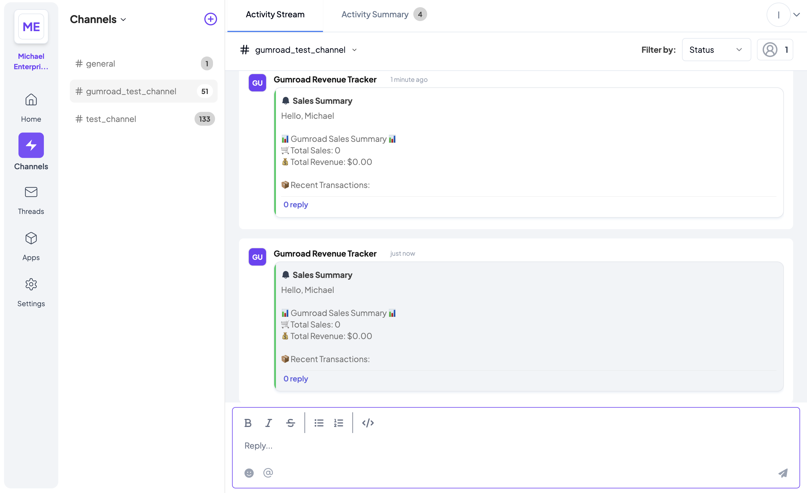

# Gumroad Telex Integration



## Overview
This project is a FastAPI integration for fetching sales data from Gumroad and sending updates to a Telex channel at specified intervals.

## Features
- Fetches sales data from the Gumroad API
- Sends formatted reports to a Telex channel
- Runs as an interval-based integration on Telex

## Setup Instructions

### Prerequisites
- Python 3.9+
- FastAPI
- Uvicorn
- `requests` library

### Installation
1. Clone the repository:
   ```sh
   git clone https://github.com/your-username/hngx-stage3-Gumroad-sales-summary.git
   cd hngx-stage3-Gumroad-sales-summary
   ```

2. Create a virtual environment:
   ```sh
   python -m venv venv
   source venv/bin/activate  # On Windows use `venv\Scripts\activate`
   ```

3. Install dependencies:
   ```sh
   pip install -r requirements.txt
   ```

### Running the Application
Start the FastAPI server with Uvicorn:
```sh
uvicorn app.main:app --reload
```
The API will be available at: `http://127.0.0.1:8000`

## Testing the Integration
You can test the `/tick` endpoint using `curl`:
```sh
curl --location 'http://localhost:8000/tick' \
--header 'Content-Type: application/json' \
--data '{
    "channel_id": "<your-test-telex-channel-id>",
    "return_url": "https://ping.telex.im/v1/return/<your-test-telex-channel-id>",
    "settings": [
        {
            "label": "gumroad_api_key",
            "type": "text",
            "required": True,
            "default": GUMROAD_API_KEY"
        },
        {
            "label": "interval",
            "type": "text",
            "required": true,
            "default": "* * * * *"
        }
    ]
}'
```

## Deployment
### Deploy on Render
1. Push the code to GitHub.
2. Create a new **Web Service** on [Render](https://render.com/).
3. Connect the repository and set the **Start Command** to:
   ```sh
   uvicorn app.main:app --host 0.0.0.0 --port $PORT
   ```
4. Set up the default environment variables for the Gumroad API keys.
5. Deploy and obtain the public URL for your API.
